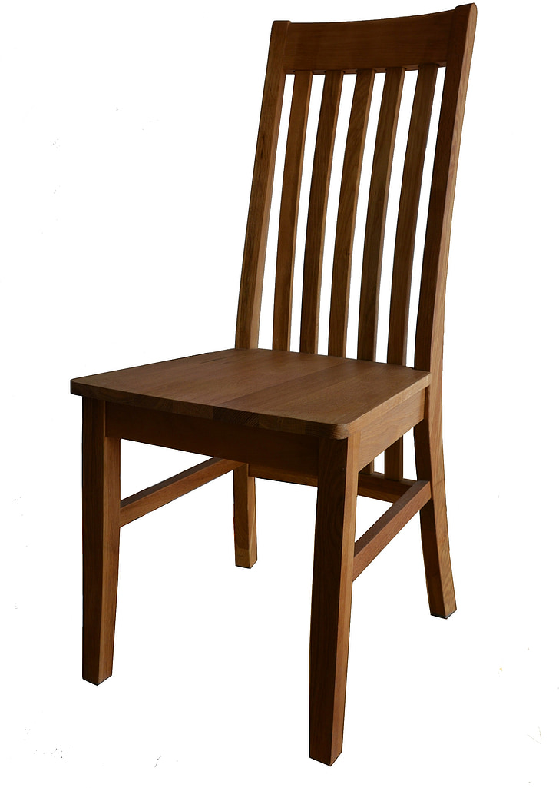

# Satellite Approximation

High performance methods for finding and estimating missing data in imagery, focusing on filling missing pixels blocked by clouds and clouds shadows in optical satellite imagery.

## Program Structure

This program is split into a number of different libraries and executables. We provide the following libraries:

- `approx`, a library used to perform Laplace and Poisson approximation on satellite imagery. This library serves mostly as an implementation of Pérez, B, and Blake, “Poisson Image Editing.” (https://dl.acm.org/doi/10.1145/1201775.882269).
- `cloud_shadow_detection`, a library used to detect clouds and cloud shadows in Sentinel-2 satellite imagery. The library is an implementation of Layton et al., “Cloud Shadow Detection via Ray Casting with Probability Analysis Refinement Using Sentinel-2 Satellite Data.” (https://www.mdpi.com/2072-4292/15/16/3955).

Examples for how to use these libraries are provided by the following executables:

- `laplace-main.cpp`, which uses Laplace approximation to estimate missing values in imagery
- `poisson-main.cpp`, which uses Poisson approximation to estimate missing values in imagery.
- `main-cloud-detection.cpp`, which uses the cloud and shadow detection library to find cloud and cloud shadows in imagery.

In addition, a Python library is provided to allow interfacing with Python and easier integration with the scientific computing ecosystem. The library was created using [Pybind11](https://pybind11.readthedocs.io/en/stable/).

## Usage

Note that this program has only been tested and used on Linux. [Conan](https://conan.io/) is used for managing and installing dependencies. To use this program, start by installing the C++ compiler and build tools for your platform, [CMake](https://cmake.org/), and then [install conan](https://conan.io/downloads). Move into the program directory and install the C++ dependencies:

```shell
conan install . -s build_type=RelWithDebInfo -b missing --update -pr:b=default -pr:h=default
```

In addition, GDAL is required. Install it using your system package manager.

To use the program in C++, use CMake to compile one of the executables:

```shell
mkdir build
cmake --preset dev -S . -B build
cmake --build build --target <target> -- -j 10
```

The target can be one of the following:
- `laplace_main`
- `poisson_main`
- `main_cloud_detection`

To use the program in Python instead, use pip to install the python library. This will build the C++ project and create the python library. 

```shell
pip install . --verbose
```

## Example Results

### Laplace Approximation

In laplace approximation, a missing function is approximated by fixing the boundary conditions and attempting to make the function change as little as possible within the missing region. This results in very good results for smooth, homogeneous regions, but poor results if structure needs to preserved. The following example shows this effect: two regions are replaced. The highly detailed structure of the trees is lost when performing approximation, however the smooth nature of the water is preserved.

<p align="middle">


</p>

### Poisson Approximation

In poisson approximation, a guidance field is used inside the unknown region, allowing for details to remain. The boundary conditions allow for smooth interpolation between the regions. If the guidance field is chosen from another image then the images can be seamlessly interpolated and stitched together. In the following example, the beach is the main photo, and the chair is the image from which the guidance field is taken. Here are the two images before any interpolation has taken place:

<p align="middle">


</p>

The results after Poisson approximation has occurred are shown in the next image. Pay close attention of the effect that the beach image has on the chair image. The contrast between the blue color of the water and the orange/yellow color of the sky and beach causes different regions of the chair to be drawn in different colors, while still preserving the structural content of the chair image.

<p align="middle">

</p>
